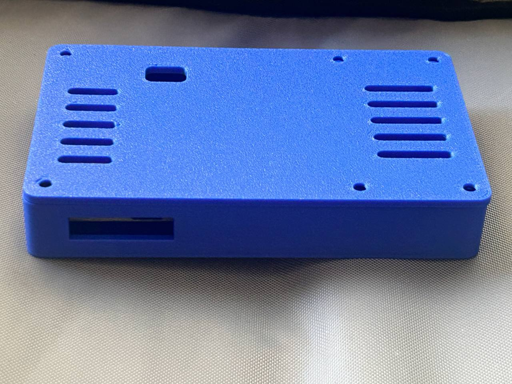
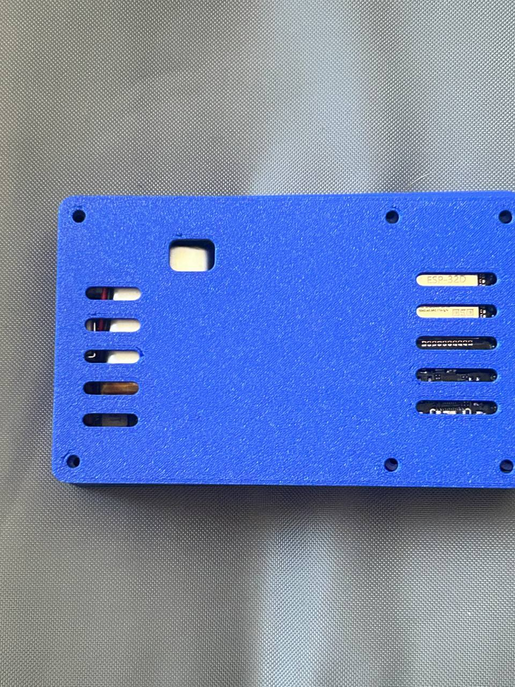
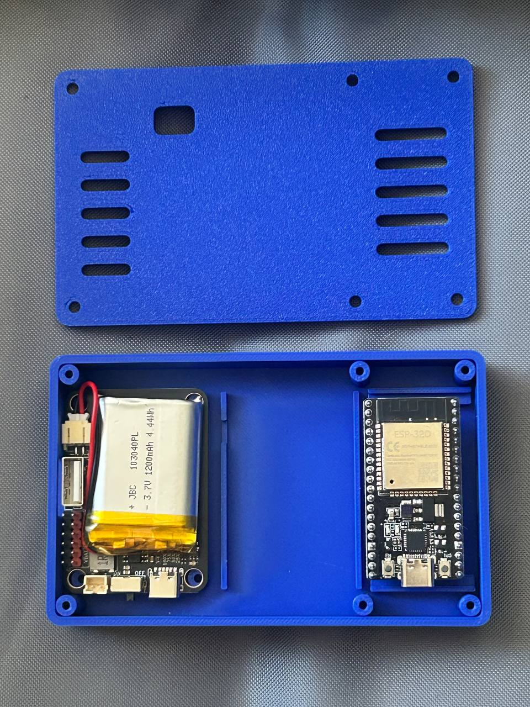
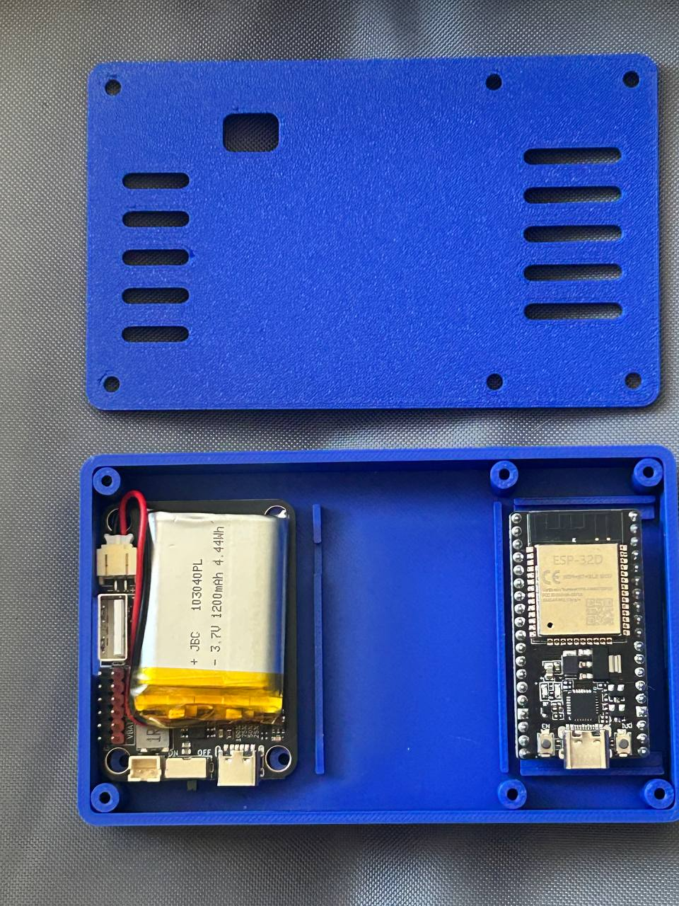
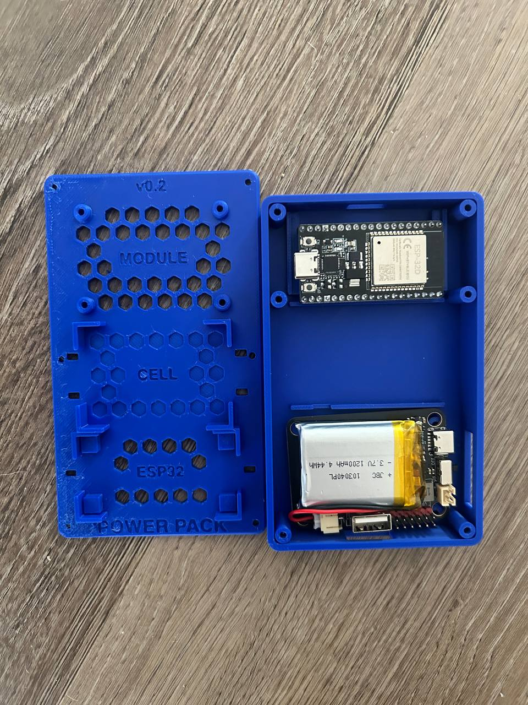
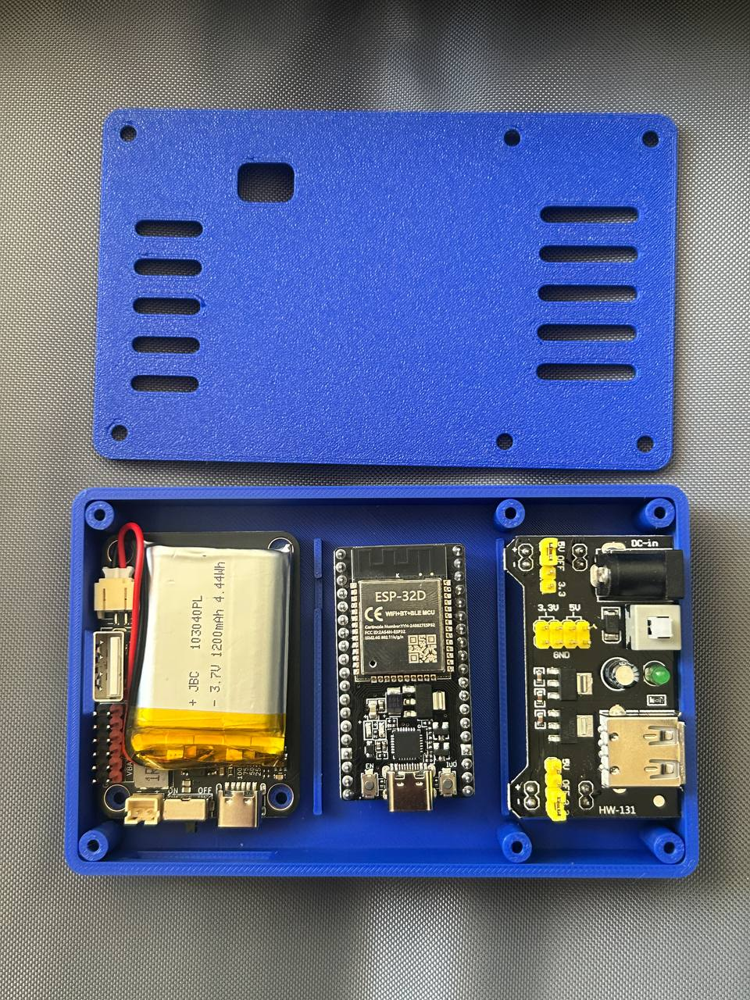
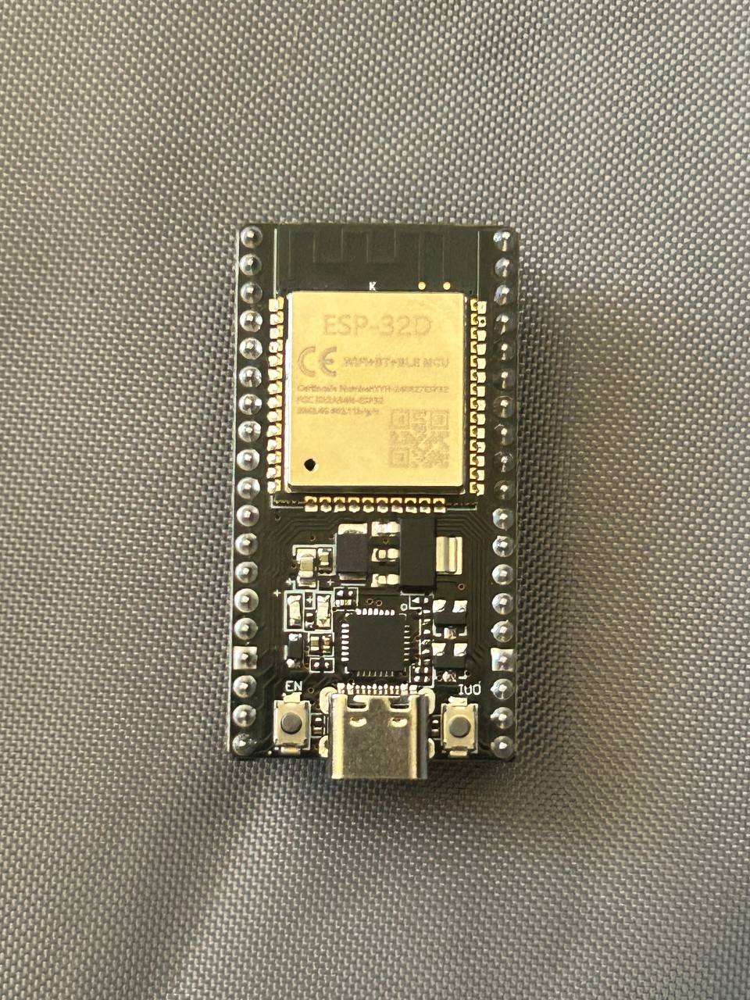
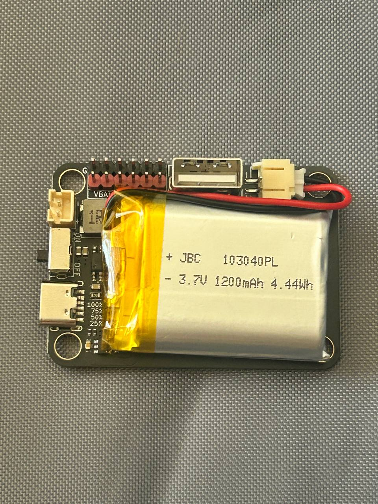
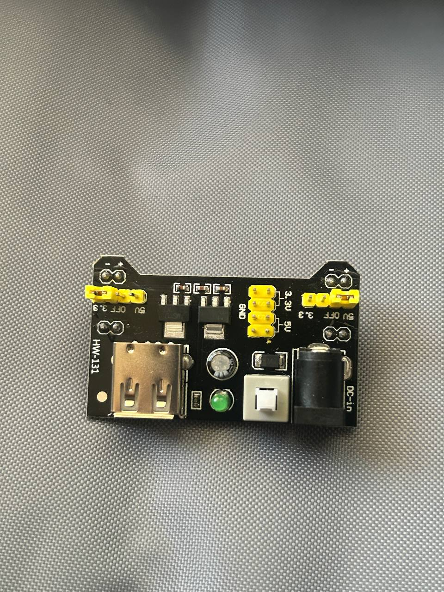
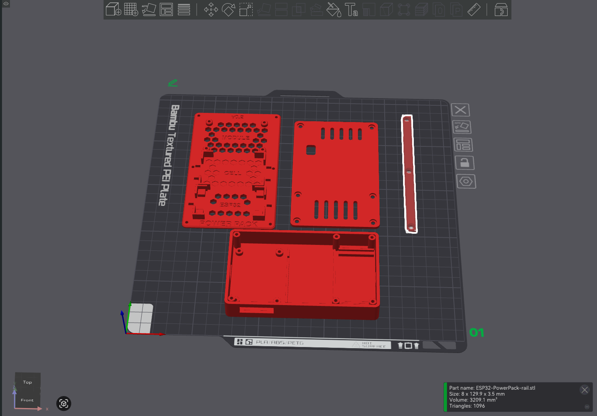

# ESP32 Power Pack Case

Mounts the **NULLLAB LiPo module** (1200 mAh, USB‑C in, USB‑A + 3V3/5V out,
4‑LED gauge), its **LiPo pouch cell**, and an **ESP32‑WROOM‑32 DevKitC‑V4**
(38‑pin, 54.4 × 27.9 mm) — the same board as `~/Code/quadruped-r1`.

Two parts, printed in this order on purpose:

| | what it is | size (mm) | why |
|---|---|---|---|
| **`sled.scad`** | open plate + 2 bolt-on rails | 76 × 129.9 × 3 | **Print this first.** No ports means nothing can be wrong about port positions. It proves the numbers. |
| **`case.scad`** | enclosed tray + lid | 72.8 × 117.8 × 19.4 | Print once the sled says the numbers are right. |

All three STLs render manifold. `exports/` is current.

---

## Printed — 2026-09-07

<p align="center">
  <a href="photos/01-case-closed-port-window.jpg">
    
  </a><br>
  <sub><b>Closed.</b> Chamfered edges, and the one port window that carries both the USB‑C charge input and the ON/OFF switch.</sub>
</p>

<table>
<tr>
<td width="50%" align="center">
  <a href="photos/02-case-closed-lid-vents.jpg"></a><br>
  <sub><b>Lid on.</b> Vent slots over both boards and the square LED‑gauge window. <code>ESP-32D</code> is legible through the slots.</sub>
</td>
<td width="50%" align="center">
  <a href="photos/03-open-lid-and-tray.jpg"></a><br>
  <sub><b>Lid off.</b> Six M3 bosses, one at each corner and one mid‑span each side.</sub>
</td>
</tr>
<tr>
<td width="50%" align="center">
  <a href="photos/04-open-tray-populated.jpg"></a><br>
  <sub><b>Populated.</b> The NULLLAB module carries its cell; the ESP32 sits in its own bay.</sub>
</td>
<td width="50%" align="center">
  <a href="photos/05-sled-printed-beside-case.jpg"></a><br>
  <sub><b>The sled, printed.</b> Hex‑lightened deck, zones engraved <code>MODULE</code> / <code>CELL</code> / <code>ESP32</code>, marked <code>v0.2</code> — printed in one colour rather than black deck + orange rails.</sub>
</td>
</tr>
<tr>
<td width="50%" align="center">
  <a href="photos/06-tray-populated-top-down.jpg"></a><br>
  <sub><b>All three bays filled.</b> The NULLLAB module with its cell, the ESP32, and an <code>HW‑131</code> breadboard supply — barrel‑jack in, USB‑A and 3V3/5V rails out. The HW‑131 is not in <code>params.scad</code>.</sub>
</td>
<td width="50%" align="center">
  <a href="photos/07-esp32-devkitc-board.jpg"></a><br>
  <sub><b>The board.</b> ESP32‑WROOM‑32 DevKitC, 38‑pin. Underside is flat — no downward breadboard pins, which is what <code>ESP_UNDER</code> assumes.</sub>
</td>
</tr>
<tr>
<td width="50%" align="center">
  <a href="photos/08-lipo-module-with-cell.jpg"></a><br>
  <sub><b>The pack.</b> NULLLAB LiPo module with the pouch cell — USB‑C in, USB‑A + 3V3/5V out, 4‑LED gauge. The cell is stamped <code>JBC 103040PL</code>.</sub>
</td>
<td width="50%" align="center">
  <a href="photos/09-hw131-power-board.jpg"></a><br>
  <sub><b>The third board.</b> <code>HW‑131</code> breadboard supply — barrel‑jack in, USB‑A out, a jumper per rail selecting 5V / OFF / 3.3V, and a power switch. It rides in the third bay but appears in no design file yet.</sub>
</td>
</tr>
</table>

### Print

One plate, four parts, Bambu Textured PEI.

<p align="center">
  <a href="photos/10-plate-layout.png">
    
  </a>
</p>

| part | size (mm) | volume | PLA, solid |
|---|---|---|---|
| `base` | 72.8 × 117.8 × 17.0 | 33,022 mm³ | 41.0 g |
| `lid` | 72.8 × 117.8 × 2.4 | 18,793 mm³ | 23.3 g |
| `plate` (sled) | 76.0 × 129.9 × 10.0 | 27,536 mm³ | 34.2 g |
| `rail` × 2 | 8.0 × 129.9 × 3.5 | 3,209 mm³ ea | 4.0 g ea |
| **case** — base + lid | | 51,815 mm³ | **64.3 g** |
| **sled** — plate + 2 rails | | 33,955 mm³ | **42.1 g** |
| **whole plate** | | 85,769 mm³ | **106.4 g** |

Volumes are computed from the exported STLs, not estimated — the `rail` figure
matches Bambu Studio's own part inspector to the tenth of a mm³ (3209.1 mm³,
1096 triangles). Mass is volume × 1.24 g/cm³, **PLA at 100 % solid**, so read
it as an upper bound; any real wall/infill profile lands under it.

**Slicer estimate:** `[TIME]` · `[FILAMENT g]` — not yet recorded. These come
off the Bambu slice panel and depend on the profile, so they are left blank
rather than guessed.

### One number to fix

`params.scad` assumed a `503450` pouch — 5.5 × 34 × 50 mm. The cell in the
photos above is stamped **`103040`**: **10.0 × 30 × 40 mm**. Wrong in all three
axes, and nearly twice the assumed thickness, so the cell rides on top of the
module instead of dropping into the bay cut for it.

`params.scad` now carries the real numbers. **The geometry has not been rebuilt
around them yet**, so `exports/` and `renders/` still show the three-bay layout.

> `case.scad` does **not** `include <params.scad>` — it keeps its own copy of
> every dimension, still carrying the old cell numbers and `ESP_L = 51.0`. Only
> `sled.scad` reads `params.scad`. Fixing that is the next job.

---

## Start here

```bash
./measure.sh -q      # the 5 numbers that change the print
./build.sh           # re-render every STL
```

Then print `exports/ESP32-PowerPack-sled.stl`, bolt the three parts down, and
find out what's wrong before committing to an enclosure.

Read [MEASURING.md](MEASURING.md) first — it has the caliper technique for the
awkward measurements, and the trick that gets the cell size without calipers at
all (the 6-digit number on a LiPo pouch *is* its dimensions: `503450` = 5.0 ×
34 × 50 mm).

---

## Files

| | |
|---|---|
| `params.scad` | **The only file with real-world measurements in it.** Everything else derives from it. Each value is tagged `M` measured / `D` datasheet / `G` guess. |
| `sled.scad` | Option D, the open fit-test plate |
| `case.scad` | the enclosed tray + lid |
| `measure.sh` | walks you through each dimension, validates the range, rewrites `params.scad` |
| `render.sh` | preview PNGs from any `.scad` **or `.stl`** |
| `build.sh` | renders every part to `exports/` |
| `check.sh` | interference test — does any printed geometry sit where a component has to go? |
| `MEASURING.md` | how to get the numbers |

### `measure.sh`

```bash
./measure.sh          # everything
./measure.sh -q       # only the 5 that matter
./measure.sh -l       # what's still a guess
```

Enter keeps the current value. Anything you type gets marked `M` (measured);
`D` means sourced from a datasheet, `G` means still a guess. Edits are made in
place, so hand-written notes in `params.scad` survive a run. Each parameter has a sane
range — type a cell thickness of 50 mm and it stops you rather than silently
producing a 54 mm tall clip.

### `render.sh`

Works on anything, including STLs you downloaded from Makerworld:

```bash
./render.sh sled.scad                      # iso, top, front, right
./render.sh exports/anything.stl -v all    # all 7 views
./render.sh sled.scad -t 24                # 24-frame turntable
./render.sh sled.scad -s 2400x1800 -c Monotone
```

Schemes: `Tomorrow Cornfield DeepOcean Starnight Nature BeforeDawn Monotone`.
An STL gets wrapped in a throwaway `.scad` so OpenSCAD can frame a camera on it.

### `check.sh`

Intersects the sled with each component's volume, grown by half its nominal
clearance. A correct part encloses **zero volume** there.

```bash
./check.sh      # PASS / FAIL
```

This caught a real bug: the corner brackets were being built *inside* each
pocket instead of outside it, shrinking every pocket by 3.2 mm in both axes.
The ESP32 and the cell would not have dropped in.

What it can and can't do:

- **Catches** geometry that collides with a component — brackets on the wrong
  side, a standoff reaching into the next bay, a zip-tie slot cutting a
  bracket's base.
- **Cannot catch a wrong measurement.** The pockets derive from `params.scad`,
  so if a number is wrong the pocket is wrong *and consistent*, and the check
  passes happily. Only a real dry fit finds those.

---

## The sled

Black hex-lightened deck, burnt-orange bolt-on side rails, screws left showing —
the same direction the ESP32 Cyberdeck Case concept already approved.

```
  #===========================#
  #|  o   module 56 x 40  o  |#   four M3 on the 48 x 32 pattern
  #|      hex cut through     |#
  #|-------------------------|#
  #|      cell 50 x 34        |#   brackets + two zip ties
  #|      hex ENGRAVED only   |#
  #|-------------------------|#
  #|  ESP32 54.4 x 27.9      |#   brackets + one zip tie
  #|      hex cut through     |#
  #===========================#
     # = orange rail, 3 exposed M3 a side
```

| part | size (mm) | qty | colour |
|---|---|---|---|
| plate | 76 × 129.9 × 3 | 1 | black |
| rail | 8 × 129.9 × 3.5 | **2** | burnt orange |

Tallest feature 10 mm. Assembled envelope 76 × 129.9 × 17.1 mm.

**Three deliberate choices:**

- **Chamfers, 1 mm top and bottom.** More than anything else, a chamfered edge
  is what stops a part reading as 3D printed. It also kills elephant's foot.
- **Only whole hexes are placed.** A hex is drawn solely if the entire cell
  clears the zone and every feature. Clipping a hex field against keepouts
  instead leaves half-eaten slivers, which read as damage.
- **The cell bay is engraved, not cut.** A pouch cell needs continuous support,
  so it gets the same grid 0.6 mm deep. The panel stays one system without
  putting holes under the battery.

Prints flat, no supports — every overhang is a 45° chamfer or steeper.

**Hardware:** 4 × M3 × 8 self-tapping (module → standoffs), 6 × M3 × 8
self-tapping (rails → plate, countersunk), 3 zip ties. If you'd rather bolt the
whole sled to something, open the plate's six holes to 3.4 mm and run M3 with
nuts instead.

**Making it look right:** the rails are a separate print, so no AMS or filament
change is needed — just print the plate in black and the two rails in orange.

---

## What's still a guess

`./measure.sh -l` is authoritative.

**Solid:** the module footprint (56 × 40, 48 × 32 hole pattern), straight off
the listing photo.

**Datasheet, not calipers:** the ESP32 footprint, 54.4 × 27.9 mm. That is the
Espressif DevKitC‑32E nominal, matching row 17 of
`~/Code/quadruped-r1/controller/docs/MEASUREMENTS.md`.

> **Note for the ESP32 Cyberdeck Case project:** it builds its pocket around
> 51 × 28 mm for what it calls the same 38‑pin board. A real 38‑pin DevKitC is
> 54.4 mm long. That pocket is likely 3.4 mm short.

**Measured off the part:** the cell — `103040`, so 10.0 × 30 × 40 mm, read
straight off the pouch label. It was the biggest guess in the project and it
was wrong in all three axes.

**Still guesses:** every remaining Z dimension.

`ESP_UNDER` is the one to watch. It assumes 3 mm of solder tail. If your
DevKitC has male breadboard pins pointing **down**, the real figure is nearer
11 mm and the ESP32 brackets are wrong — tell `measure.sh` and it rebuilds.

The enclosed case additionally guesses **port positions**, scaled off the
listing photo at 7.4 px/mm, so ±1.5 mm. Two consequences already baked in:

- USB‑C and the ON/OFF switch are ~12 mm apart, which would leave a 0.9 mm rib
  between two cutouts — too thin to print. They share **one port window**.
- The USB‑A is cut **edge‑facing**. If yours points up, that cutout moves to
  the lid.

Neither applies to the sled. That's the point of the sled.

---

## Before trusting the enclosed case

1. Print the sled. Dry-fit all three parts. Fix `params.scad`.
2. Confirm USB‑C **cable body** clearance, not just the connector.
3. Confirm the cell's JST lead reaches the module's back-edge connector —
   it's ~45 mm of routing.
4. Confirm the USB‑A is edge-facing, not vertical.
5. Print the base alone before committing to the lid.

---

## License

Two licences, because this repo holds two different kinds of thing.

| | what | licence |
|---|---|---|
| **Source** | `*.scad`, `*.sh`, `*.md` | [MIT](LICENSE) |
| **Models & images** | `exports/`, `renders/`, `photos/` | [CC BY 4.0](LICENSE-MODELS.md) |

Print it, remix it, sell what you print — just credit Jesse Diaz and link back
here. The `.scad` source is MIT, so it can be vendored into other projects on
the terms code ecosystems already expect.
